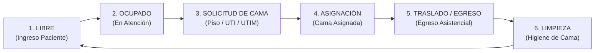

# 🏥 FlowBed

**Sistema inteligente de gestión de flujo de pacientes en guardia hospitalaria**

FlowBed es una aplicación web que optimiza la gestión de posiciones asistenciales en tiempo real, permitiendo identificar cuellos de botella y mejorar los tiempos de espera para asignación de camas.

## 🎯 Características
### 🎯 Características y Circuito Asistencial

FlowBed implementa el circuito clínico completo de internación y gestión de camas:

1. **Ingreso y Atención Inicial**: Ingreso del paciente a una posición asistencial de guardia (`LIBRE` ➡️ `OCUPADO`).
2. **Solicitud de Cama**: Solicitud formal de derivación a internación (`PISO`, `UTI`, `UTIM`) con diagnóstico/notas. Inicia el cronómetro de espera de cama.
3. **Aceptación y Asignación**: El gestor de camas / servicio receptor confirma la cama asignada (ej. *Cama 204 - Piso 2*). Detiene el cronómetro de espera.
4. **Traslado Efectivo y Egreso**: Al concretarse el traslado físico, se registran ambas métricas clave:
   - ⏱️ **Tiempo de espera de cama** (Solicitud ➡️ Asignación).
   - 🏥 **Tiempo total en guardia** (Ingreso ➡️ Traslado).
5. **Liberación y Limpieza**: La posición de guardia pasa automáticamente a estado `LIMPIEZA` para higiene sanitaria. Con 1 click (`✨ Completar Limpieza`), pasa a `LIBRE` lista para el próximo paciente.

- **22 posiciones asistenciales**:
  - 9 camas (C1–C9)
  - 8 consultorios (CONS1–CONS8)
  - 4 shock rooms (SR1–SR4)
  - 1 aislamiento (ISO1)

- **Estados de posiciones**:
  - ✅ LIBRE
  - 🔴 OCUPADO
  - 🧹 LIMPIEZA
  - 🔵 RESERVADO
  - ⚠️ FUERA_SERVICIO
  - ✅ `LIBRE`
  - 🔴 `OCUPADO` (Sub-etapas: *En Atención*, *Cama Solicitada*, *Cama Asignada*)
  - 🧹 `LIMPIEZA`
  - 🔵 `RESERVADO`
  - ⚠️ `FUERA_SERVICIO`

- **Funcionalidades**:
  - Dashboard en tiempo real con todas las posiciones
  - Cambio de estado con un click
  - **Selección de destino al ocupar**: Al cargar un paciente, se debe seleccionar su destino (PISO, UTI, UTIM)
  - **Cronómetro en tiempo real**: Muestra el tiempo transcurrido desde que se ocupó la posición
  - **Marcar destino asignado**: Detiene el cronómetro cuando el paciente obtiene su cama final
  - **Historial completo**: Registro de todos los pacientes con tiempos de espera
  - **Análisis de cuellos de botella**: Estadísticas por destino para identificar demoras
  - **Alertas visuales**: Tiempos coloreados según criticidad (verde < 30min, amarillo < 60min, rojo > 60min)
  - Dashboard reactivo con sincronización instantánea vía **Server-Sent Events (SSE)**
  - Dual cronómetro: tiempo total de estadía y tiempo de espera de cama
  - Alertas visuales por criticidad horaria (<30m, <60m, >60m)
  - Historial clínico detallado y gráficos analíticos de cuellos de botella por destino
  - Notificaciones flotantes tipo Toast en tiempo real

## 📱 Cómo usar la aplicación
## 🚀 Inicio Rápido (Instalación y Ejecución)

Sigue estos sencillos pasos para poner en marcha el proyecto en tu máquina local:

### 1. Ubicarse en el directorio del proyecto
```bash
cd /ruta/hacia/Gestor_Camas
```

### 2. Activar el entorno virtual

- **En Linux / macOS**:
  ```bash
  source venv/bin/activate
  ```
- **En Windows (PowerShell / CMD)**:
  ```cmd
  venv\Scripts\activate
  ```
  *(Nota: Si necesitas crear un entorno virtual nuevo desde cero, ejecuta `python -m venv venv` antes de activarlo).*

### 3. Instalar las dependencias
```bash
pip install -r requirements.txt
```

### 4. Aplicar las migraciones de la base de datos
```bash
python manage.py migrate
```

### 5. Inicializar las posiciones asistenciales *(Solo la primera vez)*
Crea automáticamente las 22 posiciones (9 camas, 8 consultorios, 4 shock rooms y 1 aislamiento):
```bash
python manage.py inicializar_posiciones
```

### 6. Iniciar el servidor
```bash
python manage.py runserver
```

### 7. Abrir la aplicación
Accede desde tu navegador web a:
👉 **[http://127.0.0.1:8000/](http://127.0.0.1:8000/)**

---

### 🧪 Ejecutar los Tests Automatizados
Para verificar que todos los módulos y endpoints funcionen correctamente:
Para verificar que todos los módulos y endpoints del circuito funcionen al 100%:
```bash
python manage.py test
```

---

## 📱 Manual de Uso Rápido
## 📱 Manual de Uso del Circuito

### Ocupar una posición con paciente
1. Hacer click en una posición LIBRE
2. Seleccionar estado "Ocupado"
3. Ingresar el nombre del paciente
4. **Seleccionar el destino del paciente** (PISO, UTI o UTIM)
5. Click en "Guardar"
6. La posición mostrará:
   - Nombre del paciente
   - Destino solicitado
   - **Cronómetro en tiempo real** que cuenta el tiempo de espera


### Marcar destino asignado (detener cronómetro)
1. Cuando el paciente obtenga su cama final, click en **"📍 Marcar Destino"**
2. Seleccionar el destino final donde fue asignado
3. El cronómetro **se detiene automáticamente** ⏹️
4. Se registra el evento en el historial con el tiempo exacto de espera
### Paso 1: Ingreso del paciente
1. Hacer click en una posición **LIBRE**.
2. Seleccionar estado **Ocupado**, ingresar el nombre del paciente y notas iniciales.
3. Click en **"Guardar"**. La cama queda en etapa `En Atención Inicial`.

### Ver historial y estadísticas
1. Click en **"📊 Ver Historial y Estadísticas"** en el dashboard
2. Analiza:
   - Tiempos promedio por destino (identifica cuellos de botella)
   - Historial completo de pacientes con tiempos de espera
   - Estadísticas generales del sistema
### Paso 2: Solicitar cama de internación
1. En la tarjeta del paciente, hacer click en el botón **"📋 Solicitar Cama"**.
2. Seleccionar el sector solicitado (**PISO**, **UTI** o **UTIM**) e ingresar el diagnóstico.
3. Click en **"Confirmar Solicitud"**.
4. La tarjeta mostrará el badge ámbar de espera y el **cronómetro de espera de cama** comenzará a correr.

### Desocupar una posición
1. Cambiar una posición OCUPADA a otro estado (LIBRE, LIMPIEZA, etc.)
2. El sistema limpia todos los datos automáticamente
### Paso 3: Aceptar y asignar cama
1. Cuando el sector receptor confirma la cama, click en **"🛏️ Asignar Cama"**.
2. Ingresar la identificación de la cama otorgada (ej. *Cama 312 - Piso 3*).
3. Click en **"Confirmar Asignación"**.
4. El cronómetro de espera **se detiene**, reflejando el tiempo exacto que tardó en conseguirse la cama.

### Paso 4: Traslado efectivo y egreso
1. Al momento en que el camillero o enfermero traslada físicamente al paciente a la cama asignada, click en **"🚀 Trasladar / Egresar"**.
2. Elegir el estado post-traslado para la cama de guardia (recomendado: **Limpieza**).
3. Click en **"Confirmar Traslado"**.
4. Se guarda el registro en el historial con ambas métricas (espera de cama y tiempo total en guardia).

## 🎨 Tecnologías
### Paso 5: Liberar cama tras higiene
1. En la tarjeta en estado `LIMPIEZA`, hacer click directo en **"✨ Completar Limpieza"**.
2. La cama vuelve instantáneamente a estado **LIBRE**.

- **Backend**: Django (Python)
- **Frontend**: HTML5 + CSS3 moderno + JavaScript Vanilla (Modular en `guardia/static/`)
- **Visualización Analítica**: Chart.js
- **Tiempo Real**: Server-Sent Events (SSE) con `EventSource` y reconexión automática
- **Base de datos**: SQLite
---

## 📝 Notas
## 📊 Historial y Análisis de Cuellos de Botella
- Accede mediante el botón **"📊 Ver Historial y Estadísticas"**.
- Analiza:
  - Tiempos promedio de espera de cama por sector receptor (`PISO`, `UTI`, `UTIM`).
  - Tiempos de permanencia total en el servicio de urgencias.
  - Tabla de egresos detallada con cálculo de tiempos, camas asignadas y notas clínicas.

- La aplicación se actualiza en tiempo real instantáneo mediante Server-Sent Events (SSE)
- No requiere autenticación (diseñado para estaciones y terminales compartidas de guardia)
- Notificaciones flotantes tipo Toast para alertar cambios entre operadores
- Buscador y filtrado dinámico en tiempo real
- Gráficos interactivos de tiempos de espera y cuellos de botella por destino
---

## 📈 Próximas mejoras (opcional)
## 🎨 Arquitectura y Tecnologías

- Exportar reportes en PDF/Excel
- Integración con sistema de historias clínicas (HL7 / FHIR)
- Sistema de Triage por criticidad
- Autenticación y roles de usuario (opcional)
- **Backend**: Django 6 (Python)
- **Frontend**: HTML5 + CSS3 moderno (Glassmorphism & dark/light responsive) + JavaScript Vanilla modular
- **Visualización Analítica**: Chart.js
- **Tiempo Real**: Server-Sent Events (SSE) nativo con hash-based change detection y reconexión automática
- **Base de datos**: SQLite / PostgreSQL ready

---

**Autor**: Lamas Gonzalo  
**Versión**: 2.0  
**Fecha**: 2026

# FlowBed
**Versión**: 2.1 (Circuito Clínico Completo)  
**Año**: 2026